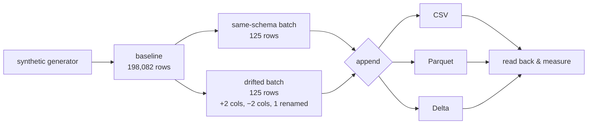

# delta-format-comparison

**What breaks when your source schema changes — a PySpark study of CSV vs Parquet vs Delta Lake.**

[](https://github.com/HAMm-CODE/delta-format-comparison/actions/workflows/ci.yml)
[](https://www.python.org/downloads/)
[](LICENSE)

## The problem

An upstream producer changes its output: a column is added, another renamed
with a unit conversion, a third dropped. Nobody tells the consumer. The append
runs. **No format raises an error.**

This project measures what each of the three common storage formats actually
does with that data — and shows that the row count looking correct is not
evidence the data is.

## Results

198,082 baseline rows, then two appends of 125 rows each: one with the original
schema, one with a drifted schema. Expected final state: 198,332 rows, 11
distinct columns.

| format  | mergeSchema | rows    | cols | size MB | Temperature_F | Start_Time | drift rejected |
|---------|-------------|---------|------|---------|---------------|------------|----------------|
| csv     | –           | 198,332 | 8    | 25.48   | `string`      | `string`   | no             |
| parquet | false       | 198,332 | 9    | 4.62    | *missing*     | `timestamp`| no             |
| parquet | true        | 198,332 | 11   | 4.62    | `double`      | `timestamp`| no             |
| delta   | false       | 198,207 | 8    | 4.61    | `double`      | `timestamp`| **YES**        |
| delta   | true        | 198,332 | 11   | 4.63    | `double`      | `timestamp`| no             |

*Measured on a 2-core / 8 GB Linux container, Spark 3.5.1, delta-spark 3.2.0,
`spark.sql.shuffle.partitions=4`. Reproduce with `python scripts/run_comparison.py`.*

## Findings

**1. CSV keeps every row and loses every type.** The count is correct, which is
the trap. Once files with mismatched columns sit in the same directory, schema
inference collapses to `string` for all eight columns — including timestamps.
Values from the drifted rows land under the wrong headers.

**2. Parquet without `mergeSchema` loses columns silently, and which ones is
arbitrary.** Spark adopts a single file's footer as the schema for the whole
dataset. In the 198K run it picked a drifted file and dropped `Temperature_F`
and `Description`. In the smaller test run it picked an original file and
dropped the three new columns instead. Both lose data; neither warns. The data
was intact on disk the entire time — you simply had to know to pass a read-time
flag you had no reason to suspect you needed.

**3. Delta is the only format that refuses the write.** It validates the
incoming schema against the table schema, rejects the append, and prints both
schemas. The table is left at 198,207 rows with types intact — the rejected
write was atomic and did no partial damage. Enabling `mergeSchema` then absorbs
the drift cleanly, but as a deliberate choice rather than a silent default.

**4. Delta's overhead over raw Parquet is 0.2%** (4.63 MB vs 4.62 MB) for schema
enforcement, ACID guarantees, and version history.

**5. Copy-on-write is the real cost, not the log.** Delta rewrites whole files
rather than editing them. On a 20,000-row table:

| operation | storage | note |
|-----------|---------|------|
| initial write | 0.49 MB | |
| MERGE (50 rows) | 0.73 MB | `numTargetRowsCopied: 9,950` |
| UPDATE | 1.21 MB | |
| DELETE (45 rows) | 1.46 MB | |
| after VACUUM | 0.49 MB | |

Storage tripled to modify 95 rows. Every superseded file stays for time travel
until `VACUUM` removes it. This is the cost that surprises people, and it's why
`OPTIMIZE` and retention policies matter in production.

## Architecture



## Running it

```bash
pip install -r requirements.txt

python scripts/run_comparison.py    # the comparison table
pytest                              # 14 tests
```

The findings above are assertions in `tests/test_drift_behaviour.py`, not just
claims in a README. If a future Spark or Delta release changes any of this
behaviour, CI fails and this document gets corrected.

Paths come from `DATA_ROOT` (default `./data`), so the same code runs against a
local directory or a Databricks Unity Catalog Volume with no edits.

## On the data

The project generates synthetic data by default. The original coursework used a
subset of the Kaggle US Accidents dataset, which is distributed under
CC BY-NC-SA 4.0 for research use — redistributing it from a portfolio
repository would not respect that licence. The generator reproduces the same
schema and row count (198,082 rows, 8 columns) deterministically from a seed,
so anyone can reproduce these numbers with no credentials and no downloads.

One honest caveat: synthetic data compresses better than the original
(5.5× CSV→Parquet here vs 3.3× on the real dataset) because it draws from 5
distinct descriptions and 8 locations, which suits dictionary encoding. The
schema-drift findings are unaffected — those are structural, not statistical.

## Layout
src/deltacompare/
schema.py explicit 8-column schema
generate.py deterministic synthetic data
config.py DATA_ROOT-based paths
session.py Delta-enabled SparkSession
storage.py recursive size measurement (Hadoop FS API, not dbutils)
formats.py unified read/write across the three formats
drift.py schema drift simulation
compare.py the experiment
ops.py MERGE, UPDATE, DELETE, VACUUM, history
## Origin

This began as coursework for COMP.CS.320 Data-Intensive Programming at Tampere
University. It has been rewritten to remove the Databricks-only dependencies
(`dbutils`, `display`), replace the hardcoded course storage paths with
environment configuration, generate its own data, and cover the findings with
tests. See [NOTICE.md](NOTICE.md) for attribution.
